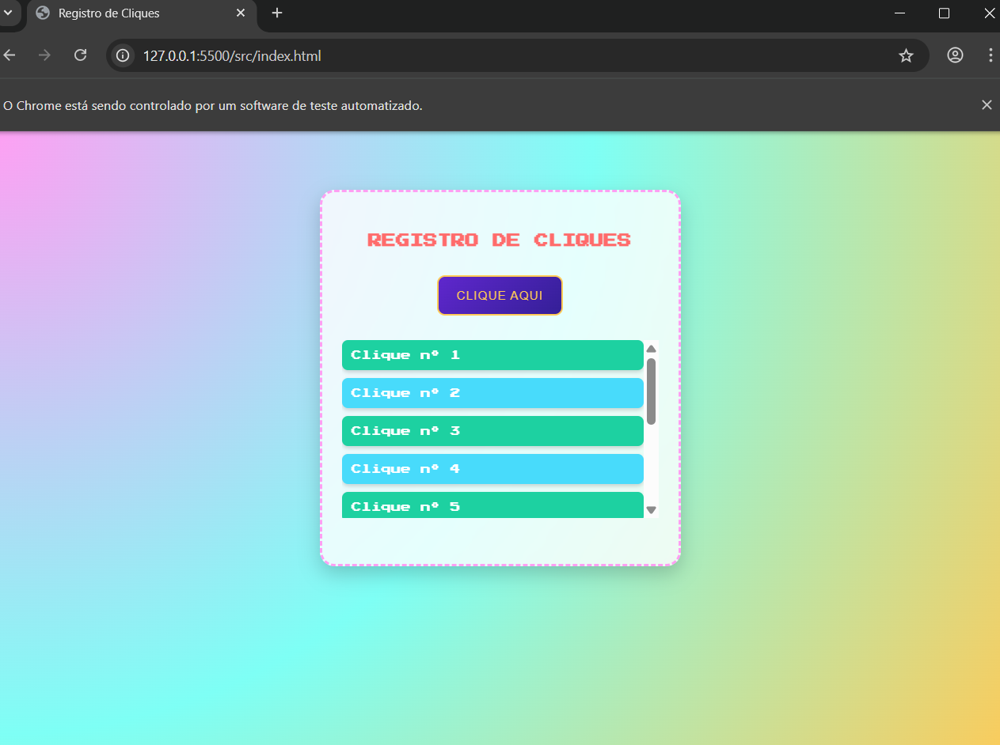

# Contador de Cliques – Qualidade de Software

Trabalho desenvolvido para a disciplina **Qualidade de Software**.  
O sistema registra cliques de um botão e exibe um histórico numerado de cliques na tela, com design alternativo.

## Tecnologias
- HTML5  
- CSS3  
- JavaScript  
- Testes automatizados com Selenium (Python)

## Como usar
Abra o arquivo `index.html` no navegador ou publique via GitHub Pages.  
Para rodar o teste automatizado, execute `teste_cliques.py` com Python e Selenium configurados.

---
